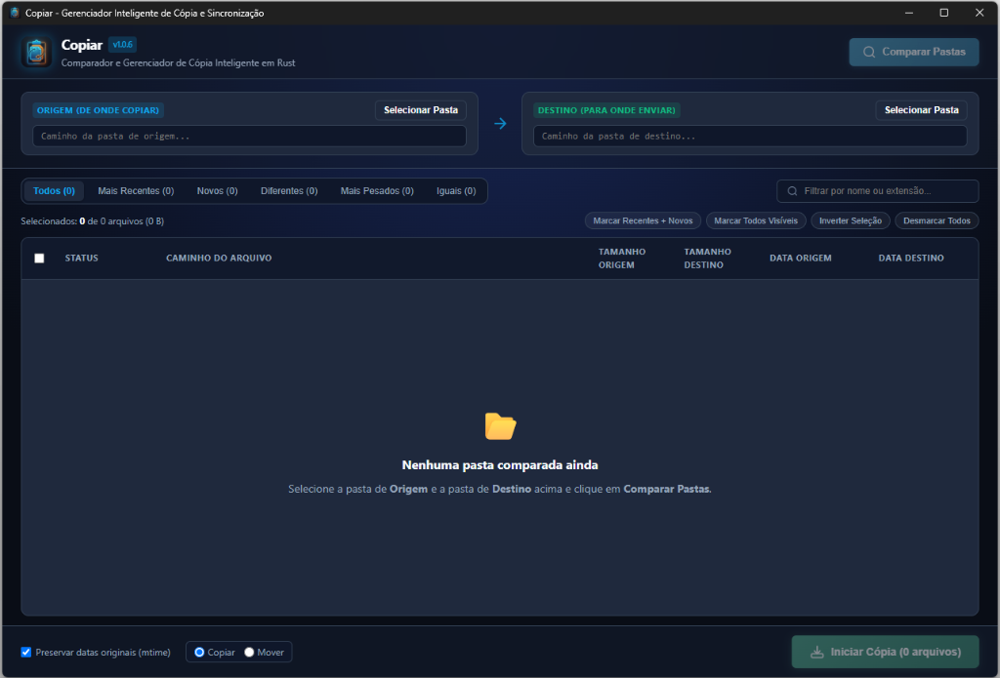
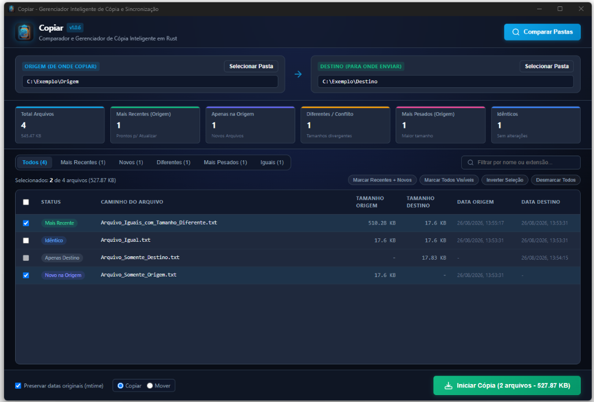

# Copiar 🚀

> Gerenciador e Comparador Inteligente de Cópia e Sincronização de Arquivos em **Rust** + **Tauri v2**.
>
> 📥 **Downloads disponíveis diretamente na aba de [Releases](https://github.com/Blastoles/Copiar/releases) do GitHub** (instaladores `.msi` e `.exe` para Windows).

---

## 📸 Screenshots

### Tela Inicial (Aguardando Comparação)


### Comparação Concluída com Métricas e Diferenças


---

## ⚡ Recursos Principais

- **Varredura Paralela Ultrarrápida:** Usa `rayon` e `walkdir` para escanear centenas de milhares de arquivos em milissegundos.
- **Categorização Automática:**
  - 🟢 **Mais Recentes:** Arquivos na origem com data (`mtime`) superior ao destino.
  - 🟣 **Apenas na Origem:** Arquivos novos inexistentes no destino.
  - 🟡 **Diferentes / Conflito:** Arquivos com divergência de tamanho ou conteúdo.
  - 🌸 **Mais Pesados:** Arquivos com tamanho maior na origem.
  - 🔵 **Idênticos:** Arquivos já sincronizados.
- **Seleção Inteligente em Lote:** Botões de ação rápida para marcar somente atualizações, inverter ou selecionar visíveis.
- **Tabela Virtualizada:** Suporta visualização de listas gigantescas sem travar o navegador/DOM.
- **Engine Nativa de Cópia e Movimentação:** Streaming assíncrono em chunks com reporte em tempo real de velocidade (MB/s), bytes transferidos e preservação de data original (`mtime`).

---

## 🛠️ Como Executar

### Pré-requisitos
- [Rust & Cargo](https://www.rust-lang.org/) (versão 1.75+)
- [Node.js](https://nodejs.org/) (opcional, para CLI do Tauri)

### 1. Instalar dependências da CLI Tauri
```bash
npm install
```

### 2. Rodar em Modo de Desenvolvimento
```bash
npm run dev
# ou
npx @tauri-apps/cli dev
```

### 3. Rodar Testes de Unidade da Engine Rust
```bash
cargo test --manifest-path src-tauri/Cargo.toml
```

### 4. Gerar Binário de Produção com Versionamento Automático
```powershell
# Incrementa a versão (ex: 1.0.0 -> 1.0.1) e faz o build completo
.\build.ps1

# Ou para incrementar versão minor (ex: 1.0.0 -> 1.1.0)
.\build.ps1 -IncrementType minor
```
